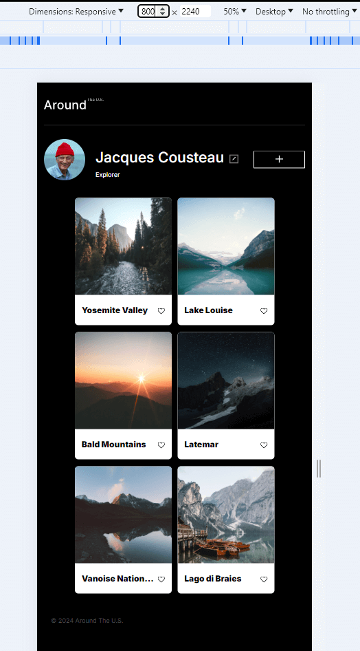

# Projects 3 - 9: Around The U.S.

## https://aemxr.github.io/se_project_aroundtheus/

### Overview

- Intro
- Figma
- Images

**Intro**

Around The U.S. is project 3 through 9 of the software engineer online course from TripleTen. It displays a header, a profile section, cards for 6 scenic locations from The United States, and a footer. The project is focused on responsive design, accessibility, best practices for formatting, and deploying to github using gitbash. Project 4 and 5 illustrates the JavaScript functionality of the buttons and modal. Project 6 showcases the validation functionality of the modals. Projects 7 - 9 has yet to be implemented.

Using Figma, I followed the UI design and exported assets. The HTML and CSS were coded from scratch using flex display, margins, paddings, and box-sizing for layout and responsive design. Semantic HTML5 elements and accessibility best practices were followed according to BEM standards. CSS classes, ID's, and media queries were used.

**Figma**

- [Link to project 3 on Figma](https://www.figma.com/file/ii4xxsJ0ghevUOcssTlHZv/Sprint-3%3A-Around-the-US?node-id=0%3A1)

- [Link to project 4 on Figma](https://www.figma.com/file/EO5AaNCuzzFL7X5gSY7HwQ/Sprint-4_-Around-The-U.S.-_-desktop-%2B-mobile?t=3hvVWRz9LUFsxyNn-6)

- [Link to project 5 on Figma]()

- [Link to project 6 on Figma]()

- [Link to project 7 on Figma]()

- [Link to project 8 on Figma]()

- [Link to project 9 on Figma]()

**Video Explanation**
https://drive.google.com/file/d/1dntgUV8j2Emr-2n8yiIfPCCQ9m7X-KfW/view?usp=sharing

**Images**

